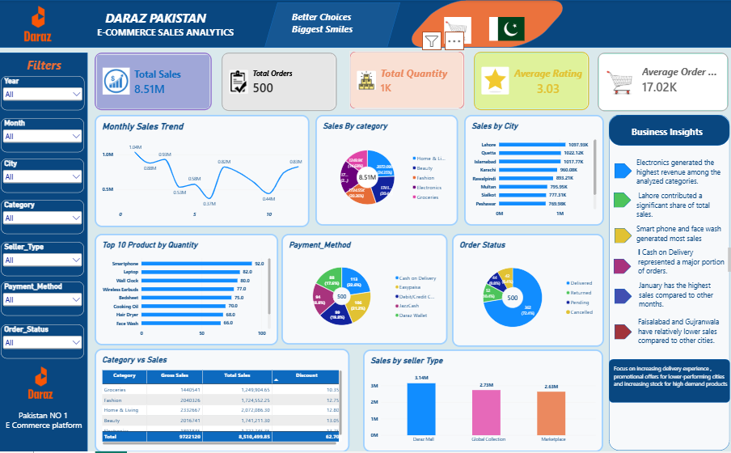

# Daraz-Pakistan-Sales-Analysis-dashboard
## 📊 Project Overview

This project is a Power BI dashboard developed to analyze e-commerce sales performance for Daraz Pakistan.
The dashboard provides an interactive view of sales, orders, quantities, ratings, products, categories, cities, payment methods, order status, and seller types.
The goal of this project is to transform e-commerce sales data into meaningful business insights using Power BI.

## 🛠️ Tools & Technologies

- Power BI
- Power Query
- DAX
- Microsoft Excel
- Data Visualization
- Business Intelligence

## 📌 Dashboard KPIs

The dashboard provides key performance indicators including:

- Total Sales: 8.51M
- Total Orders: 500
- Total Quantity: Approximately 1K
- Average Rating: 3.03
- Average Order Value: 17.02K

## 📈 Dashboard Analysis

The dashboard includes the following analysis:

### 1. Monthly Sales Trend
Shows how sales performance changes over the selected months.

### 2. Sales by Category
Analyzes sales contribution across different product categories.

### 3. Sales by City
Compares sales performance across cities including Lahore, Quetta, Islamabad, Karachi, Rawalpindi, Multan, Sialkot, and Peshawar.

### 4. Top 10 Products by Quantity
Identifies products with the highest quantities sold.

### 5. Payment Method Analysis
Shows the distribution of orders across different payment methods.

### 6. Order Status
Provides an overview of delivered, returned, pending, and cancelled orders.

### 7. Category Sales
Provides a detailed comparison of category-level sales and discounts.

### 8. Sales by Seller Type
Compares sales generated by different seller types.

## 💡 Business Insights

Some observations presented by the dashboard include:

- Electronics generated significant revenue among the analyzed categories.
- Lahore recorded the highest sales among the displayed cities.
- Smartphones and face wash were among the products generating high sales/quantity.
- Cash on Delivery represented a significant portion of orders.
- January showed the highest monthly sales in the displayed trend.
- Faisalabad and Gujranwala recorded relatively lower sales compared with the other displayed cities.

These observations are based on the data represented in the Power BI dashboard.

## 🎯 Project Objectives

The main objectives of this project are:

1. Analyze e-commerce sales performance.
2. Identify high-performing categories and products.
3. Compare sales across cities.
4. Analyze customer payment preferences.
5. Understand order status distribution.
6. Compare seller performance.
7. Present business insights through an interactive Power BI dashboard.

## 📁 Repository Structure

```text
daraz-pakistan-sales-analysis-powerbi/
│
├── README.md
├── PowerBI/
│   └── Daraz_Pakistan_Sales_Analytics.pbix
├── Dashboard/
│   └──
├── Data/
│   └── Daraz_Sales_Data.xlsx
└── Documentation/
    └── Project_Overview.pdf
Author
Akhtar Abbas

Data Analyst | Power BI | Excel | SQL | Data Visualization

📄 Disclaimer
This project is created for learning, portfolio, and data analytics demonstration purposes.
